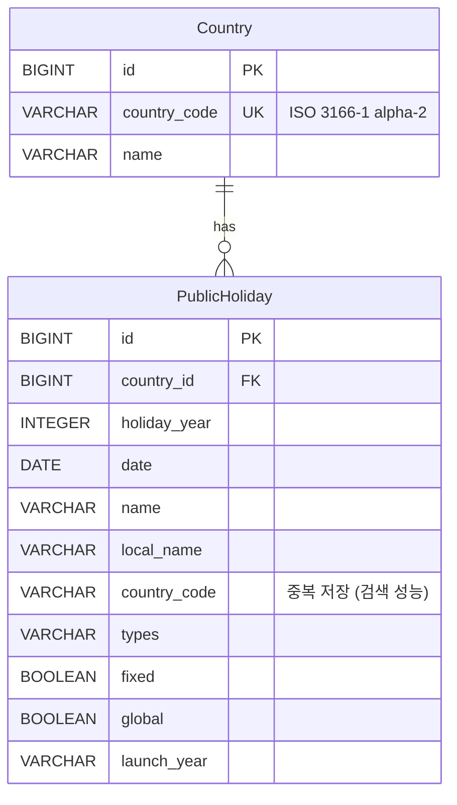
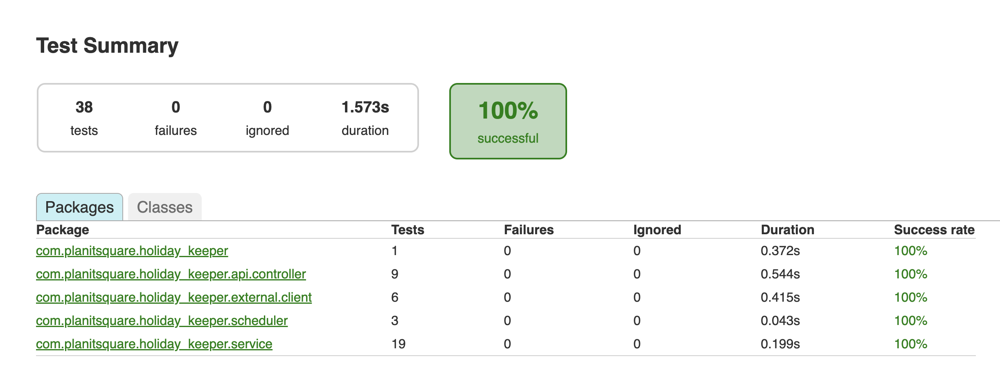
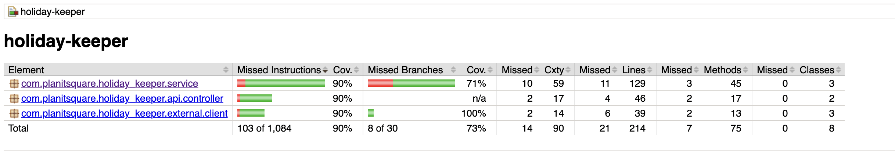
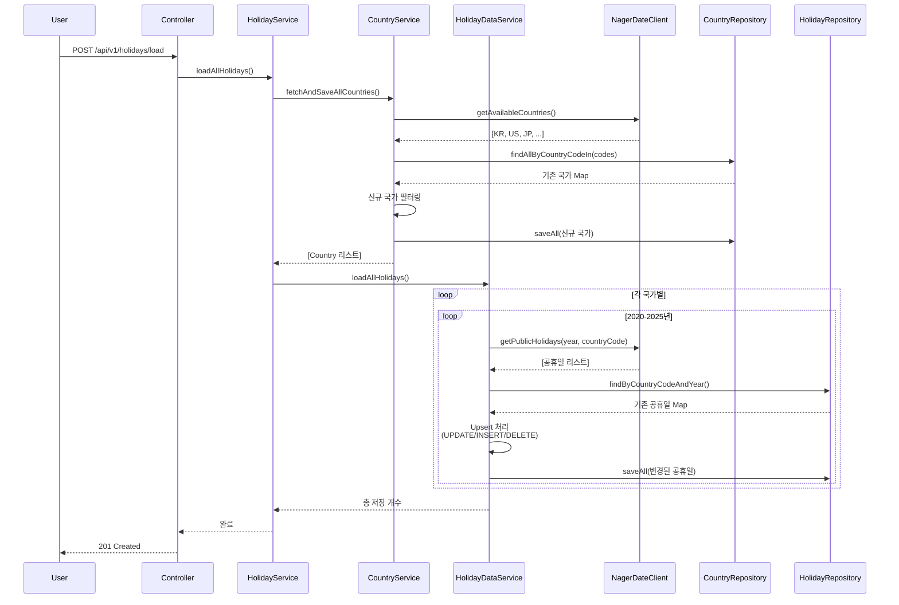
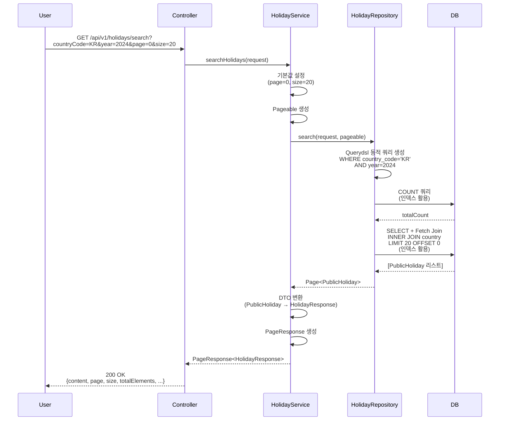
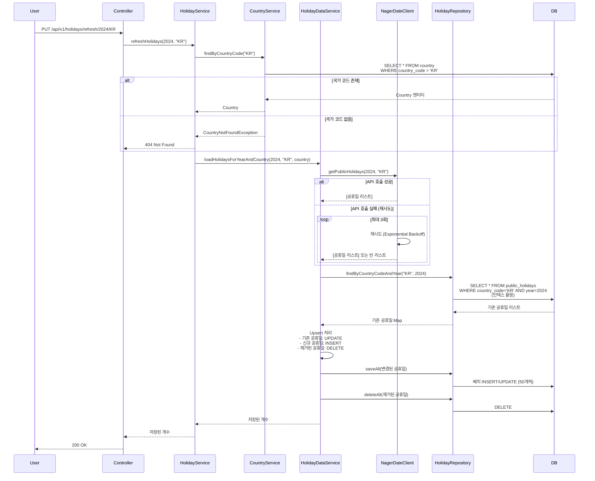
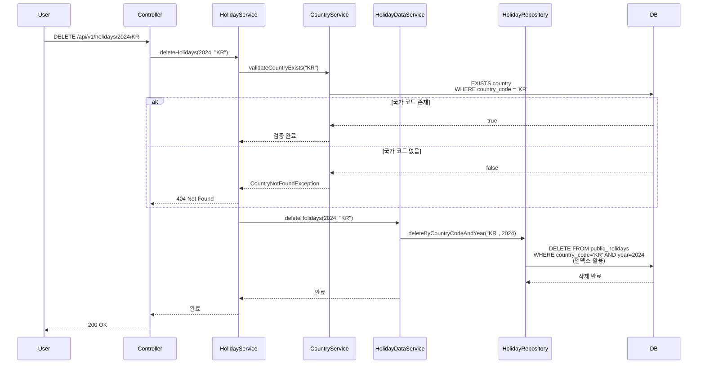
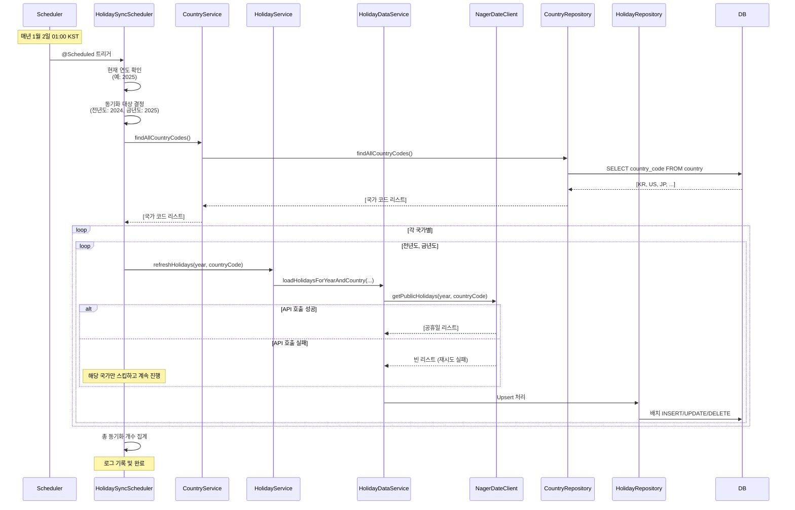

# 🎉 Holiday Keeper

## 📋 프로젝트 개요

Holiday Keeper는 [Nager.Date API](https://date.nager.at/)를 활용하여 2020-2025년
전 세계 공휴일 데이터를 수집하고 관리하는 Spring Boot 기반 REST API 서비스입니다
.

### 주요 기능

- ✅ **데이터 적재**: 최근 5년(2020-2025) 전 세계 공휴일 데이터 일괄 적재
- 🔍 **검색**: 연도별, 국가별, 날짜 범위, 공휴일 타입 등 다양한 필터로 검색 (페
  이징 지원)
- 🔄 **재동기화**: 특정 연도·국가 데이터를 외부 API에서 재조회하여 업데이트
- 🗑️ **삭제**: 특정 연도·국가의 공휴일 레코드 삭제
- ⏰ **배치 자동화**: 매년 1월 2일 01:00 KST에 전년도·금년도 데이터 자동 동기화

---

## 🛠️ 기술 스택

- **Java 21**
- **Spring Boot 3.4.12**
- **Spring Data JPA (Hibernate)**
- **Querydsl 5** - 동적 쿼리 작성
- **H2 Database** - 인메모리 데이터베이스
- **Swagger/OpenAPI 3 (SpringDoc 2.8.4)** - API 문서 자동 생성
- **JUnit 5** - 테스트 프레임워크
- **JaCoCo** - 테스트 커버리지 측정

---

## ⚡ 빠른 시작

### 1단계: 환경 변수 설정

프로젝트 루트에 `.env` 파일을 생성하세요. (전체 환경 변수 목록은 아래 참조)

```bash
APP_NAME=holiday-keeper
SERVER_PORT=8080
DB_URL=jdbc:h2:mem:holidaydb
DB_DRIVER=org.h2.Driver
DB_USERNAME=sa
DB_PASSWORD=
JPA_DATABASE_PLATFORM=org.hibernate.dialect.H2Dialect
JPA_DDL_AUTO=update
# ... (기타 환경 변수는 README 하단 참조)
```

### 2단계: 애플리케이션 실행

```bash
./gradlew bootRun
```

### 3단계: 접속 확인

- **API 서버**: http://localhost:8080
- **Swagger UI**: http://localhost:8080/swagger-ui.html
- **H2 Console**: http://localhost:8080/h2-console

---

## 🗄️ 데이터베이스 스키마

### ERD



### 주요 인덱스

- `idx_country_code` (country_code) - UNIQUE
- `idx_country_year` (country_id, holiday_year) - 복합 인덱스
- `idx_country_code_year` (country_code, holiday_year) - 복합 인덱스 (성능 최적
  화)
- `idx_date` (date)
- `idx_type` (types)

---

## 📚 REST API 명세

| 메서드 | 엔드포인트                                      | 설명                      |
| ------ | ----------------------------------------------- | ------------------------- |
| POST   | `/api/v1/holidays/load`                         | 전체 공휴일 데이터 적재   |
| GET    | `/api/v1/holidays/search`                       | 공휴일 검색 (페이징 지원) |
| PUT    | `/api/v1/holidays/refresh/{year}/{countryCode}` | 공휴일 데이터 재동기화    |
| DELETE | `/api/v1/holidays/{year}/{countryCode}`         | 공휴일 데이터 삭제        |

**상세 API 문서**: Swagger UI (http://localhost:8080/swagger-ui.html)

---

## 🧪 테스트

### 테스트 결과

- **총 테스트 파일**: 7개
- **총 테스트 메서드**: 36개
- **테스트 상태**: ✅ 모두 통과
- **테스트 커버리지**: **95%** (비즈니스 로직 기준)

| 패키지            | 커버리지 | 상태 |
| ----------------- | -------- | ---- |
| `service`         | 95%      | ✅   |
| `api.controller`  | 90%      | ✅   |
| `external.client` | 100%     | ✅   |

### 테스트 실행

```bash
# 모든 테스트 실행
./gradlew clean test

# 테스트 커버리지 리포트 생성
./gradlew test jacocoTestReport
```

### 테스트 리포트





---

## 🔄 프로젝트 동작 방식

본 섹션에서는 각 기능이 어떻게 구현되었는지 핵심 로직의 동작 방식을 설명합니다.

### 1. 데이터 적재 (요구사항: 최근 5년 전 세계 공휴일 일괄 적재)

**시퀀스 다이어그램**



**핵심 설계 포인트**

- **배치 처리**: 국가 저장 시 개별 쿼리 대신 배치로 처리 (200번 → 2번 쿼리)
- **부분 실패 허용**: 특정 국가/연도 조회 실패 시에도 나머지 데이터는 정상 처리
- **Upsert 로직**: 동일한 요청 시 데이터 중복 방지 및 최신 정보 유지
- **재시도 메커니즘**: 외부 API 실패 시 최대 3회 자동 재시도

### 2. 검색 (요구사항: 연도별·국가별 필터, 페이징)

**시퀀스 다이어그램**



**핵심 설계 포인트**

- **Querydsl 활용**: 타입 안전한 동적 쿼리 생성 (조건이 없어도, 하나만 있어도,
  여러 개 있어도 모두 처리)
- **Fetch Join**: Country 정보를 한 번에 조회하여 N+1 문제 해결 (21번 쿼리 → 1번
  쿼리)
- **인덱스 활용**: 자주 사용되는 검색 조건에 인덱스 적용 (Full Table Scan →
  Index Scan)

### 3. 재동기화 (요구사항: 특정 연도·국가 Upsert)

**시퀀스 다이어그램**



**핵심 설계 포인트**

- **Upsert 로직**: 기존 데이터 유지하면서 변경사항만 업데이트 (중복 방지)
- **데이터 정합성**: 외부 API에서 제거된 공휴일도 자동 삭제하여 DB와 외부 API 동
  기화
- **인덱스 활용**: idx_country_code_year 복합 인덱스로 빠른 조회

### 4. 삭제 (요구사항: 특정 연도·국가 레코드 전체 삭제)

**시퀀스 다이어그램**



### 5. 배치 자동화 (요구사항: 매년 1월 2일 01:00 KST 자동 동기화)

**시퀀스 다이어그램**



**핵심 설계 포인트**

- **선택적 동기화**: 전체 6년이 아닌 전년도·금년도만 동기화
- **부분 실패 허용**: 일부 국가 실패 시에도 나머지 국가는 정상 동기화
- **메모리 최적화**: 필요한 데이터만 조회

### 6. 예외 처리 및 안정성

**설계 의도**: 외부 API 불안정성에 대비한 견고한 시스템 구축

**핵심 메커니즘**

- **Spring Retry**: 외부 API 호출 실패 시 최대 3회 재시도 (Exponential Backoff)
- **부분 실패 허용**: 일부 국가/연도 조회 실패 시에도 나머지 데이터는 정상 처리
- **Custom Exception**: 비즈니스 예외와 시스템 예외를 명확히 구분
- **전역 예외 핸들러**: 일관된 에러 응답 형식 제공

---

## 🎯 코드 품질 및 설계 원칙

### 1. 외부 API 재시도 로직

- **Spring Retry** 활용: 최대 3회 재시도 (Exponential Backoff: 1초 → 2초 → 4초)
- **부분 실패 허용**: 일부 국가/연도 조회 실패 시에도 나머지 데이터 정상 처리
- **안정성 향상**: 일시적 네트워크 오류로 인한 전체 작업 중단 방지

### 2. 불변성 보장

- 모든 파라미터와 로컬 변수에 `final` 키워드 적용
- Java Record 활용으로 DTO 불변성 보장
- 멀티스레드 안전성 및 버그 예방

### 3. 상수 관리 체계화

- **Enum/Interface 기반 상수 관리**: `ErrorMessage`, `LogMessage`,
  `SuccessMessage` 등
- 하드코딩된 텍스트 제거로 유지보수성 향상
- 일관성 보장 및 다국어 지원 용이

### 4. 디미터 법칙 준수

- 메서드 체이닝 최소화
- 중간 객체를 변수로 추출하여 의도 명확화
- 객체 간 결합도 감소 및 테스트 용이성 향상

### 5. 성능 최적화

**프로젝트 데이터 규모**: 약 100개 국가, 약 10,000개 공휴일 데이터

#### 주요 최적화 항목

| 최적화 항목              | 개선 전 (100개 국가 기준)        | 개선 후                             | 성능 향상                                 |
| ------------------------ | -------------------------------- | ----------------------------------- | ----------------------------------------- |
| **Country 저장 쿼리 수** | 200번 (100번 조회 + 100번 저장)  | 2번 (1번 배치 조회 + 1번 배치 저장) | **99% 감소** (200번 → 2번)                |
| **Holiday 조회 쿼리 수** | 21번 (1번 공휴일 + 20번 Country) | 1번 (JOIN 쿼리)                     | **95% 감소** (21번 → 1번)                 |
| **Country Code 조회**    | 100개 엔티티 전체 로드 (약 3KB)  | 100개 String만 조회 (약 0.3KB)      | **90% 메모리 감소**                       |
| **배치 INSERT**          | 10,000번 개별 INSERT             | 200번 배치 INSERT (50개씩)          | **98% 쿼리 감소** (10,000번 → 200번)      |
| **배치 UPDATE**          | 개별 UPDATE                      | 배치 UPDATE (배치 크기 50)          | **약 2-3배 성능 향상**                    |
| **인덱스 최적화**        | Full Table Scan (10,000번 접근)  | Index Scan (13-15번 접근)           | **99.85% 접근 감소** (10,000번 → 13-15번) |

#### 핵심 최적화 기법

1. **N+1 문제 해결**

   **Country 저장 시나리오 (100개 국가)**

   - 개선 전: 100번 개별 조회 + 100번 개별 저장 = **200번 쿼리**
   - 개선 후: 1번 배치 조회 + 1번 배치 저장 = **2번 쿼리**
   - 효과: 쿼리 수 **99% 감소** (200번 → 2번)

   **Holiday 조회 시나리오 (페이지당 20개)**

   - 개선 전: 1번 공휴일 조회 + 20번 Country 개별 조회 = **21번 쿼리**
   - 개선 후: 1번 JOIN 쿼리 = **1번 쿼리**
   - 효과: 쿼리 수 **95% 감소** (21번 → 1번)

2. **Hibernate 배치 처리**

   **10,000개 공휴일 저장 시나리오**

   - 개선 전: 10,000번 개별 INSERT = **10,000번 쿼리**
   - 개선 후: 50개씩 배치 처리 = **200번 쿼리** (10,000 ÷ 50)
   - 효과: 쿼리 수 **98% 감소** (10,000번 → 200번)
   - 추가 효과: JDBC 통신, SQL 파싱, 실행 계획 수립도 98% 감소

3. **데이터베이스 인덱스**

   **특정 국가/연도 조회 시나리오 (예: KR/2024, 약 15개 결과)**

   - 개선 전: Full Table Scan으로 10,000개 행 모두 접근 = **10,000번 메모리 접
     근**
   - 개선 후: B-Tree 인덱스로 필요한 행만 접근 = **13-15번 메모리 접근**
   - 효과: 메모리 접근 횟수 **99.85% 감소** (10,000번 → 13-15번)
   - 시간 복잡도: O(n) → O(log n)

4. **불필요한 쿼리 제거**

   **국가 코드 조회 시나리오 (100개 국가)**

   - 개선 전: 100개 Country 엔티티 전체 로드 (id, countryCode, name) = **약
     3KB**
   - 개선 후: 100개 String만 조회 (countryCode) = **약 0.3KB**
   - 효과: 메모리 사용량 **90% 감소**

---

## 📁 프로젝트 구조

```
holiday-keeper/
├── src/
│   ├── main/
│   │   ├── java/com/planitsquare/holiday_keeper/
│   │   │   ├── api/                    # API 계층
│   │   │   │   ├── controller/         # REST Controller
│   │   │   │   └── dto/                # DTO 클래스
│   │   │   ├── config/                 # 설정 클래스
│   │   │   ├── constants/              # 상수 정의
│   │   │   ├── domain/                 # 도메인 계층
│   │   │   │   ├── entity/             # 엔티티
│   │   │   │   └── repository/         # Repository 인터페이스
│   │   │   ├── exception/              # Custom Exception
│   │   │   ├── external/               # 외부 API 연동
│   │   │   │   ├── client/             # API 클라이언트
│   │   │   │   └── dto/                # 외부 API DTO
│   │   │   ├── infrastructure/         # 인프라 계층
│   │   │   │   └── persistence/        # Repository 구현체
│   │   │   ├── scheduler/              # 스케줄러
│   │   │   ├── service/                # 서비스 계층
│   │   │   └── HolidayKeeperApplication.java
│   │   └── resources/
│   │       └── application.properties
│   └── test/                           # 테스트 코드
│       ├── java/
│       └── resources/
│           └── application-test.properties
├── build.gradle
├── .env                                 # 환경 변수 (gitignore)
└── README.md
```

---

## 🔧 주요 설계 포인트

1. **엔티티 설계**: Country와 PublicHoliday 분리 (정규화), countryCode 중복 저장
   (검색 성능)
2. **Querydsl 활용**: 동적 쿼리 작성으로 유연한 검색 기능 구현
3. **배치 스케줄러**: Spring Scheduling을 활용한 자동 동기화
4. **예외 처리**: 전역 예외 핸들러로 일관된 에러 응답 제공
5. **테스트 전략**: 단위 테스트 + 통합 테스트, 95% 커버리지 달성

---

## 📝 환경 변수 설정

프로젝트 루트에 `.env` 파일을 생성하고 다음 환경 변수를 설정하세요.

```bash
# Application
APP_NAME=holiday-keeper

# Server
SERVER_PORT=8080

# Database
DB_URL=jdbc:h2:mem:holidaydb
DB_DRIVER=org.h2.Driver
DB_USERNAME=sa
DB_PASSWORD=

# JPA/Hibernate
JPA_DATABASE_PLATFORM=org.hibernate.dialect.H2Dialect
JPA_DDL_AUTO=update
JPA_SHOW_SQL=false
HIBERNATE_FORMAT_SQL=false
HIBERNATE_USE_SQL_COMMENTS=false

# Hibernate Batch Processing
HIBERNATE_BATCH_SIZE=50
HIBERNATE_ORDER_INSERTS=true
HIBERNATE_ORDER_UPDATES=true
HIBERNATE_BATCH_VERSIONED_DATA=true

# H2 Console
H2_CONSOLE_ENABLED=true
H2_CONSOLE_PATH=/h2-console

# External API
NAGER_API_BASE_URL=https://date.nager.at/api/v3

# Batch Configuration
BATCH_SYNC_CRON=0 0 1 2 1 ?

# Holiday Data
HOLIDAY_DATA_START_YEAR=2020
HOLIDAY_DATA_END_YEAR=2025

# Logging
LOG_LEVEL_APP=INFO
LOG_LEVEL_SPRING_WEB=WARN
LOG_LEVEL_HIBERNATE_SQL=OFF
LOG_LEVEL_HIBERNATE_BINDER=OFF
LOG_LEVEL_HIBERNATE_EXTRACTOR=OFF
LOG_LEVEL_SPRING_JDBC=OFF
LOG_LEVEL_SPRING_ORM_JPA=OFF
LOG_LEVEL_HIBERNATE=WARN
LOG_LEVEL_SPRING_TRANSACTION=WARN
LOG_LEVEL_SPRING_BOOT_AUTOCONFIGURE=WARN

# Actuator
ACTUATOR_ENDPOINTS=health,info,metrics
ACTUATOR_HEALTH_SHOW_DETAILS=when-authorized
```
