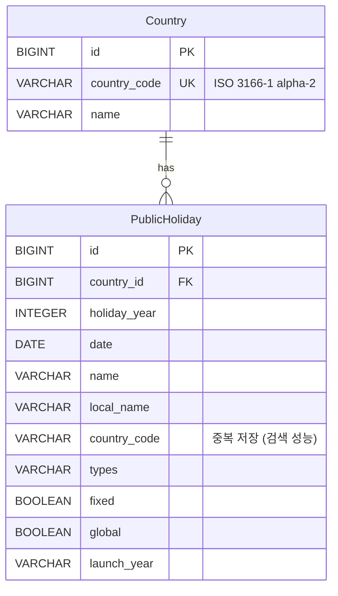

# 🎉 Holiday Keeper

전 세계 공휴일 데이터를 저장·조회·관리하는 Mini Service

## 📋 프로젝트 개요

Holiday Keeper는 [Nager.Date API](https://date.nager.at/)를 활용하여 2020-2025년
전 세계 공휴일 데이터를 수집하고 관리하는 Spring Boot 기반 REST API 서비스입니다
.

### 주요 기능

- ✅ **데이터 적재**: 최근 5년(2020-2025) 전 세계 공휴일 데이터 일괄 적재
- 🔍 **검색**: 연도별, 국가별, 날짜 범위, 공휴일 타입 등 다양한 필터로 검색 (페
  이징 지원)
- 🔄 **재동기화**: 특정 연도·국가 데이터를 외부 API에서 재조회하여 업데이트
- 🗑️ **삭제**: 특정 연도·국가의 공휴일 레코드 삭제
- ⏰ **배치 자동화**: 매년 1월 2일 01:00 KST에 전년도·금년도 데이터 자동 동기화

## 🛠️ 기술 스택

- **Java 21**
- **Spring Boot 3.4.12**
- **Spring Data JPA (Hibernate)**
- **Querydsl 5** - 동적 쿼리 작성
- **H2 Database** - 인메모리 데이터베이스
- **Swagger/OpenAPI 3 (SpringDoc 2.8.4)** - API 문서 자동 생성
- **JUnit 5** - 테스트 프레임워크
- **JaCoCo** - 테스트 커버리지 측정

## ⚡ 빠른 시작 (Quick Start)

### 1단계: 프로젝트 클론

```bash
git clone <repository-url>
cd holiday-keeper
```

### 2단계: 환경 변수 설정

프로젝트 루트에 `.env` 파일을 생성하세요:

```bash
cat > .env << 'EOF'
# Application
APP_NAME=holiday-keeper
SERVER_PORT=8080

# Database (H2 In-Memory)
DB_URL=jdbc:h2:mem:holidaydb
DB_DRIVER=org.h2.Driver
DB_USERNAME=sa
DB_PASSWORD=

# JPA
JPA_DATABASE_PLATFORM=org.hibernate.dialect.H2Dialect
JPA_DDL_AUTO=update
JPA_SHOW_SQL=true
JPA_FORMAT_SQL=true
JPA_USE_SQL_COMMENTS=true

# H2 Console
H2_CONSOLE_ENABLED=true
H2_CONSOLE_PATH=/h2-console

# External API
NAGER_API_BASE_URL=https://date.nager.at/api/v3

# Batch
BATCH_SYNC_CRON=0 0 1 2 1 ?

# Holiday Data
HOLIDAY_DATA_START_YEAR=2020
HOLIDAY_DATA_END_YEAR=2025

# Logging
LOG_LEVEL_APP=DEBUG
LOG_LEVEL_SPRING_WEB=INFO
LOG_LEVEL_HIBERNATE_SQL=DEBUG

# Actuator
ACTUATOR_ENDPOINTS=health,info,metrics
ACTUATOR_HEALTH_SHOW_DETAILS=when-authorized
EOF
```

### 3단계: 애플리케이션 실행

```bash
./gradlew bootRun
```

### 4단계: 접속 확인

- **API 서버**: http://localhost:8080
- **Swagger UI**: http://localhost:8080/swagger-ui.html
- **H2 Console**: http://localhost:8080/h2-console
  - JDBC URL: `jdbc:h2:mem:holidaydb`
  - Username: `sa`
  - Password: (비어있음)

## 🚀 상세 실행 가이드

### 사전 요구사항

- **Java 21** 이상
- **Gradle 8.5** 이상 (또는 Gradle Wrapper 사용)

### 로컬 실행

#### 방법 1: Gradle Wrapper 사용 (권장)

```bash
./gradlew bootRun
```

#### 방법 2: JAR 파일 실행

```bash
./gradlew clean build
java -jar build/libs/holiday-keeper-0.0.1-SNAPSHOT.jar
```

## 🗄️ 데이터베이스 스키마

### ERD (Entity Relationship Diagram)



### 테이블 구조

#### Country (국가)

| 컬럼           | 타입       | 제약조건 | 설명                           |
| -------------- | ---------- | -------- | ------------------------------ |
| `id`           | BIGINT     | PK, AI   | 기본 키, 자동 증가             |
| `country_code` | VARCHAR(2) | UNIQUE   | 국가 코드 (ISO 3166-1 alpha-2) |
| `name`         | VARCHAR    | NOT NULL | 국가명                         |

**인덱스**

- `idx_country_code` (country_code) - UNIQUE

#### PublicHoliday (공휴일)

| 컬럼           | 타입        | 제약조건 | 설명                                   |
| -------------- | ----------- | -------- | -------------------------------------- |
| `id`           | BIGINT      | PK, AI   | 기본 키, 자동 증가                     |
| `country_id`   | BIGINT      | FK, NN   | Country 테이블 참조                    |
| `holiday_year` | INTEGER     | NOT NULL | 연도                                   |
| `date`         | DATE        | NOT NULL | 공휴일 날짜                            |
| `name`         | VARCHAR     | NOT NULL | 공휴일 이름 (영문)                     |
| `local_name`   | VARCHAR     | NOT NULL | 공휴일 이름 (현지어)                   |
| `country_code` | VARCHAR(2)  | NOT NULL | 국가 코드 (검색 성능을 위해 중복 저장) |
| `types`        | VARCHAR(50) | NOT NULL | 공휴일 타입                            |
| `fixed`        | BOOLEAN     | NOT NULL | 고정 공휴일 여부                       |
| `global`       | BOOLEAN     | NOT NULL | 전 세계 공휴일 여부                    |
| `launch_year`  | VARCHAR(10) | NULL     | 공휴일 시작 연도                       |

**인덱스**

- `idx_country_year` (country_id, holiday_year) - 복합 인덱스
- `idx_date` (date)
- `idx_type` (types)

### SQL DDL 스크립트

```sql
-- Country 테이블 생성
CREATE TABLE countries (
    id BIGINT AUTO_INCREMENT PRIMARY KEY,
    country_code VARCHAR(2) NOT NULL UNIQUE,
    name VARCHAR(255) NOT NULL
);

-- Country 테이블 인덱스
CREATE UNIQUE INDEX idx_country_code ON countries(country_code);

-- PublicHoliday 테이블 생성
CREATE TABLE public_holidays (
    id BIGINT AUTO_INCREMENT PRIMARY KEY,
    country_id BIGINT NOT NULL,
    holiday_year INTEGER NOT NULL,
    date DATE NOT NULL,
    name VARCHAR(255) NOT NULL,
    local_name VARCHAR(255) NOT NULL,
    country_code VARCHAR(2) NOT NULL,
    types VARCHAR(50) NOT NULL,
    fixed BOOLEAN NOT NULL,
    global BOOLEAN NOT NULL,
    launch_year VARCHAR(10),
    CONSTRAINT fk_public_holiday_country
        FOREIGN KEY (country_id) REFERENCES countries(id)
        ON DELETE CASCADE
);

-- PublicHoliday 테이블 인덱스
CREATE INDEX idx_country_year ON public_holidays(country_id, holiday_year);
CREATE INDEX idx_date ON public_holidays(date);
CREATE INDEX idx_type ON public_holidays(types);
```

## 📚 REST API 명세

### Base URL

```
http://localhost:8080/api/v1
```

### 1. 전체 공휴일 데이터 적재

전체 국가의 2020-2025년 공휴일 데이터를 일괄 적재합니다.

**엔드포인트**

```
POST /api/v1/holidays/load
```

**요청 예시**

```bash
curl -X POST http://localhost:8080/api/v1/holidays/load
```

**응답 예시**

```json
{
  "success": true,
  "message": "전체 공휴일 데이터 적재가 완료되었습니다",
  "data": null
}
```

---

### 2. 공휴일 검색

다양한 필터 조건으로 공휴일을 검색합니다.

**엔드포인트**

```
GET /api/v1/holidays/search
```

**쿼리 파라미터**

| 파라미터      | 타입      | 필수 | 설명                                | 예시         |
| ------------- | --------- | ---- | ----------------------------------- | ------------ |
| `countryCode` | String    | 선택 | 국가 코드 (ISO 3166-1 alpha-2)      | `KR`         |
| `year`        | Integer   | 선택 | 연도 (2000년 이후)                  | `2024`       |
| `from`        | LocalDate | 선택 | 시작 날짜                           | `2024-01-01` |
| `to`          | LocalDate | 선택 | 종료 날짜                           | `2024-12-31` |
| `types`       | String    | 선택 | 공휴일 타입                         | `Public`     |
| `page`        | Integer   | 선택 | 페이지 번호 (0부터 시작, 기본값: 0) | `0`          |
| `size`        | Integer   | 선택 | 페이지 크기 (기본값: 20, 최대: 100) | `20`         |

**요청 예시**

```bash
# 한국의 2024년 공휴일 조회
curl "http://localhost:8080/api/v1/holidays/search?countryCode=KR&year=2024"

# 날짜 범위로 검색
curl "http://localhost:8080/api/v1/holidays/search?from=2024-01-01&to=2024-03-31"

# 페이징 적용
curl "http://localhost:8080/api/v1/holidays/search?countryCode=KR&page=0&size=10"
```

**응답 예시**

```json
{
  "success": true,
  "message": "요청이 성공적으로 처리되었습니다",
  "data": {
    "content": [
      {
        "id": 1,
        "countryCode": "KR",
        "countryName": "South Korea",
        "year": 2024,
        "date": "2024-01-01",
        "name": "New Year's Day",
        "localName": "신정",
        "types": "Public",
        "fixed": true,
        "global": false,
        "launchYear": "1949"
      }
    ],
    "page": 0,
    "size": 20,
    "totalElements": 15,
    "totalPages": 1,
    "first": true,
    "last": true
  }
}
```

---

### 3. 공휴일 데이터 재동기화

특정 연도와 국가의 공휴일 데이터를 외부 API에서 재조회하여 업데이트합니다.

**엔드포인트**

```
PUT /api/v1/holidays/refresh/{year}/{countryCode}
```

**경로 변수**

| 변수          | 타입    | 설명      | 예시   |
| ------------- | ------- | --------- | ------ |
| `year`        | Integer | 연도      | `2024` |
| `countryCode` | String  | 국가 코드 | `KR`   |

**요청 예시**

```bash
curl -X PUT http://localhost:8080/api/v1/holidays/refresh/2024/KR
```

**응답 예시**

```json
{
  "success": true,
  "message": "2024년 KR 공휴일 15개가 재동기화되었습니다",
  "data": null
}
```

---

### 4. 공휴일 데이터 삭제

특정 연도와 국가의 공휴일 데이터를 삭제합니다.

**엔드포인트**

```
DELETE /api/v1/holidays/{year}/{countryCode}
```

**경로 변수**

| 변수          | 타입    | 설명      | 예시   |
| ------------- | ------- | --------- | ------ |
| `year`        | Integer | 연도      | `2024` |
| `countryCode` | String  | 국가 코드 | `KR`   |

**요청 예시**

```bash
curl -X DELETE http://localhost:8080/api/v1/holidays/2024/KR
```

**응답 예시**

```json
{
  "success": true,
  "message": "2024년 KR 공휴일 데이터가 삭제되었습니다",
  "data": null
}
```

---

## 📖 API 문서 확인

Swagger UI를 통해 인터랙티브한 API 문서를 확인할 수 있습니다.

1. 애플리케이션 실행 후 브라우저에서 접속:

   ```
   http://localhost:8080/swagger-ui.html
   ```

2. OpenAPI JSON 다운로드:
   ```
   http://localhost:8080/v3/api-docs
   ```

## 🧪 테스트

### 테스트 실행

```bash
# 모든 테스트 실행
./gradlew clean test

# 특정 테스트 클래스만 실행
./gradlew test --tests CountryServiceTest

# 테스트 리포트 확인
open build/reports/tests/test/index.html
```

### 테스트 커버리지 확인

```bash
# 테스트 실행 + 커버리지 리포트 생성
./gradlew test jacocoTestReport

# HTML 리포트 열기
open build/reports/jacoco/test/html/index.html
```

### 테스트 결과

#### 테스트 통계

- **총 테스트 파일**: 7개
- **총 테스트 메서드**: 36개
- **테스트 상태**: ✅ 모두 통과

#### 테스트 파일 목록

1. `HolidayControllerTest` - REST API 컨트롤러 테스트
2. `GlobalExceptionHandlerTest` - 전역 예외 처리 테스트
3. `CountryServiceTest` - 국가 서비스 테스트
4. `HolidayServiceFacadeTest` - 공휴일 서비스 Facade 테스트
5. `HolidayDataServiceTest` - 공휴일 데이터 서비스 테스트
6. `NagerDateClientTest` - 외부 API 클라이언트 테스트
7. `HolidaySyncSchedulerTest` - 스케줄러 테스트

#### 테스트 커버리지

**전체 커버리지: 95%** (비즈니스 로직 기준)

| 패키지            | 커버리지 | 상태 |
| ----------------- | -------- | ---- |
| `service`         | 95%      | ✅   |
| `api.controller`  | 90%      | ✅   |
| `external.client` | 100%     | ✅   |

**제외 항목** (테스트 불필요)

- `config` - 설정 클래스
- `constants` - 상수 정의
- `dto` - 데이터 전송 객체
- `entity` - JPA 엔티티
- `scheduler` - 스케줄러 (선택적)
- `infrastructure.persistence` - Querydsl 구현체

**커버리지 리포트 위치**

```
build/reports/jacoco/test/html/index.html
```

## 🎯 코드 품질 및 설계 원칙

본 프로젝트는 **유지보수성**, **확장성**, **안정성**을 고려하여 다음과 같은 설계
원칙과 코드 품질 개선 사항을 적용했습니다.

### 1. 외부 API 재시도 로직 (Retry Pattern)

외부 API 호출의 일시적 실패에 대응하기 위해 **Spring Retry**를 활용한 재시도 메
커니즘을 구현했습니다.

#### 구현 내용

- **최대 재시도 횟수**: 3회 (초기 시도 1회 + 재시도 2회)
- **재시도 전략**: Exponential Backoff (1초 → 2초 → 4초)
- **재시도 대상 예외**: `RestClientException` (네트워크 오류, 타임아웃 등)
- **실패 처리**: 모든 재시도 실패 시 예외를 던지지 않고 빈 리스트 반환 후 로그기
  록, 다음 요청 계속 처리

#### 코드 예시

```java
@Retryable(retryFor = {RestClientException.class}, maxAttempts = 3,
        backoff = @Backoff(delay = 1000, multiplier = 2))
public List<NagerHolidayResponse> getPublicHolidays(final Integer year,
        final String countryCode) {
    // API 호출 로직
}

@Recover
public List<NagerHolidayResponse> recoverHolidays(final RestClientException e,
        final Integer year, final String countryCode) {
    log.error(EXTERNAL_API_RETRY_SKIPPED.getMessage(),
            "공휴일 조회 (%s/%d)".formatted(countryCode, year));
    return Collections.emptyList(); // 예외 없이 빈 리스트 반환
}
```

#### 효과

- **안정성 향상**: 일시적 네트워크 오류로 인한 전체 작업 중단 방지
- **부분 실패 허용**: 일부 국가/연도 조회 실패 시에도 나머지 데이터는 정상 처리
- **자동 복구**: 짧은 시간 내 복구되는 오류는 자동으로 해결

### 2. 불변성 보장 (Immutability)

변경 가능성을 최소화하여 **버그 예방**과 **코드 안정성**을 확보했습니다.

#### 적용 원칙

- **모든 파라미터에 `final` 키워드 적용**: 메서드 내에서 파라미터 재할당 방지
- **로컬 변수에 `final` 키워드 적용**: 의도치 않은 변수 변경 방지
- **Java Record 활용**: DTO 클래스를 Record로 구현하여 불변성 보장

#### 코드 예시

```java
public PageResponse<HolidayResponse> searchHolidays(final HolidaySearchRequest request) {
    final HolidaySearchRequest requestWithDefaults = request.withDefaults();
    final Pageable pageable = createPageable(requestWithDefaults);
    final Page<PublicHoliday> holidayPage =
            holidayRepository.search(requestWithDefaults, pageable);
    return convertToPageResponse(holidayPage);
}
```

#### 효과

- **부작용 방지**: 메서드 내부에서 파라미터나 변수가 변경되지 않음을 보장
- **가독성 향상**: 변수의 불변성을 명시적으로 표현
- **멀티스레드 안전성**: 불변 객체는 스레드 안전성을 자연스럽게 보장

### 3. 상수 관리 체계화

하드코딩된 텍스트와 매직 넘버를 제거하고 **Enum/Interface 기반 상수 관리**를 통
해 유지보수성을 향상시켰습니다.

#### 상수 관리 구조

- **`ErrorCode` Enum**: 표준화된 에러 코드 관리
- **`ErrorMessage` Enum**: 에러 메시지 중앙 관리
- **`LogMessage` Enum**: 로그 메시지 중앙 관리
- **`SuccessMessage` Enum**: 성공 메시지 중앙 관리
- **`SwaggerMessage` Interface**: Swagger 어노테이션용 상수 (컴파일 타임 상수 요
  구사항)
- **`HolidayType` Enum**: 공휴일 타입 관리

#### 코드 예시

```java
// ❌ 하드코딩 (개선 전)
log.error("외부 API 재시도 모두 실패, 요청 건너뜀: 공휴일 조회 (KR/2024)");

// ✅ 상수 관리 (개선 후)
log.error(EXTERNAL_API_RETRY_SKIPPED.getMessage(),
        EXTERNAL_API_OPERATION_HOLIDAYS.getMessage());
```

#### 효과

- **일관성**: 동일한 메시지가 프로젝트 전역에서 일관되게 사용
- **유지보수성**: 메시지 변경 시 한 곳만 수정하면 전체 반영
- **다국어 지원 용이**: 향후 다국어 지원 시 상수만 교체하면 됨
- **오타 방지**: 컴파일 타임에 상수 존재 여부 확인 가능

### 4. 디미터 법칙 (Law of Demeter) 준수

객체 간 결합도를 낮추고 **캡슐화**를 강화하여 코드의 유연성을 높였습니다.

#### 적용 원칙

- **직접적인 객체만 접근**: 메서드 체이닝을 최소화하고 필요한 경우 중간 객체를변
  수로 추출
- **의도 명확화**: 메서드 호출 체인을 분리하여 각 단계의 의도를 명확히 표현

#### 코드 예시

```java
// ❌ 디미터 법칙 위반 (개선 전)
holidayRepository.search(request, pageable).getContent().stream()
    .map(h -> new HolidayResponse(h.getDate(), h.getName()))
    .collect(Collectors.toList());

// ✅ 디미터 법칙 준수 (개선 후)
final Page<PublicHoliday> holidayPage =
        holidayRepository.search(requestWithDefaults, pageable);
final List<HolidayResponse> content =
        convertToHolidayResponses(holidayPage.getContent());
```

#### 효과

- **결합도 감소**: 객체 간 직접적인 의존성 감소
- **테스트 용이성**: 각 단계를 독립적으로 테스트 가능
- **가독성 향상**: 각 단계의 의도가 명확하게 드러남
- **유지보수성**: 중간 객체 구조 변경 시 영향 범위 최소화

### 5. 함수 분리 및 단일 책임 원칙 (SRP)

복잡한 로직을 **작은 단위의 함수로 분리**하여 각 함수가 하나의 책임만 수행하도록
설계했습니다.

#### 적용 사례

##### 5.1 서비스 레이어 분리

원래 `HolidayService`에 집중되어 있던 책임을 다음과 같이 분리했습니다:

- **`HolidayService`** (Facade): 외부 인터페이스 제공, 다른 서비스 조율
- **`HolidayDataService`**: 공휴일 데이터 적재/동기화/삭제 담당
- **`CountryService`**: 국가 정보 관리 담당

```java
// HolidayService: Facade 역할
@Transactional
public Integer refreshHolidays(final Integer year, final String countryCode) {
    log.info(REFRESH_START.getMessage(), year, countryCode);
    final Country country = countryService.findByCountryCode(countryCode);
    return holidayDataService.loadHolidaysForYearAndCountry(year, countryCode, country);
}
```

##### 5.2 복잡한 메서드 분리

`HolidayRepositoryImpl`의 검색 조건 빌딩 로직을 각 조건별로 분리했습니다:

```java
private BooleanBuilder buildSearchConditions(final HolidaySearchRequest request,
        final QPublicHoliday holiday) {
    final BooleanBuilder builder = new BooleanBuilder();

    addCountryCodeCondition(builder, holiday, request.countryCode());
    addYearCondition(builder, holiday, request.year());
    addDateRangeCondition(builder, holiday, request.from(), request.to());
    addTypesCondition(builder, holiday, request.types());

    return builder;
}

private void addCountryCodeCondition(final BooleanBuilder builder,
        final QPublicHoliday holiday, final String countryCode) {
    if (countryCode != null && !countryCode.isEmpty()) {
        builder.and(holiday.countryCode.eq(countryCode));
    }
}
```

##### 5.3 데이터 변환 로직 분리

`HolidayDataService`의 복잡한 변환 로직을 각 단계별로 분리했습니다:

```java
private Integer loadHolidaysForAllCountriesAndYears(final List<Country> countries,
        final Map<String, Country> countryMap) {
    Integer totalLoaded = 0;
    for (final Country country : countries) {
        totalLoaded += loadHolidaysForCountry(country, countryMap);
    }
    return totalLoaded;
}

private Integer loadHolidaysForCountry(final Country country,
        final Map<String, Country> countryMap) {
    final String countryCode = country.getCountryCode();
    Integer loadedCount = 0;

    for (Integer year = startYear; year <= endYear; year++) {
        try {
            final Integer loaded = loadHolidaysForYearAndCountry(year, countryCode,
                    countryMap.get(countryCode));
            loadedCount += loaded;
        } catch (final Exception e) {
            log.error(LOAD_HOLIDAYS_FAILED.getMessage(), year, countryCode, e.getMessage());
        }
    }
    return loadedCount;
}
```

#### 효과

- **가독성 향상**: 각 함수가 명확한 목적을 가져 이해하기 쉬움
- **테스트 용이성**: 작은 단위의 함수는 테스트 작성이 간단함
- **재사용성**: 분리된 함수는 다른 곳에서도 재사용 가능
- **유지보수성**: 특정 기능 수정 시 해당 함수만 수정하면 됨
- **디버깅 용이성**: 문제 발생 시 문제가 있는 함수를 빠르게 식별 가능

### 6. 트랜잭션 관리 명시화

읽기 전용 트랜잭션과 쓰기 트랜잭션을 **명시적으로 구분**하여 성능과 데이터 일관
성을 최적화했습니다.

#### 적용 원칙

- **`@Transactional(readOnly = true)`**: 조회 작업에 적용하여 읽기 전용 최적화
- **`@Transactional`**: 데이터 변경 작업에만 적용하여 트랜잭션 범위 최소화

```java
@Service
@Transactional(readOnly = true)  // 기본값: 읽기 전용
public class HolidayService {

    @Transactional  // 쓰기 작업: 명시적으로 트랜잭션 활성화
    public void loadAllHolidays() {
        holidayDataService.loadAllHolidays();
    }

    // 읽기 작업: 클래스 레벨 @Transactional(readOnly = true) 적용
    public PageResponse<HolidayResponse> searchHolidays(
            final HolidaySearchRequest request) {
        // ...
    }
}
```

#### 효과

- **성능 최적화**: 읽기 전용 트랜잭션은 데이터베이스 최적화 활용
- **명확성**: 각 메서드의 트랜잭션 범위가 명확하게 드러남
- **데이터 일관성**: 쓰기 작업의 트랜잭션 경계가 명확하여 일관성 보장

## 📊 코드 품질 지표

| 항목              | 적용 여부 | 비고                                         |
| ----------------- | --------- | -------------------------------------------- |
| **재시도 로직**   | ✅        | Spring Retry (최대 3회, Exponential Backoff) |
| **불변성 보장**   | ✅        | `final` 키워드, Java Record 활용             |
| **상수 관리**     | ✅        | Enum/Interface 기반 중앙 관리                |
| **디미터 법칙**   | ✅        | 메서드 체이닝 최소화, 의도 명확화            |
| **함수 분리**     | ✅        | 단일 책임 원칙 준수, 작은 단위 함수          |
| **트랜잭션 관리** | ✅        | 읽기/쓰기 명시적 구분                        |

## ⏰ 배치 스케줄러

매년 1월 2일 01:00 KST에 자동으로 전년도와 금년도 공휴일 데이터를 동기화합니다.

**설정 변경** `.env` 파일에서 cron 표현식을 수정할 수 있습니다:

```bash
BATCH_SYNC_CRON=0 0 1 2 1 ?  # 매년 1월 2일 01:00
```

## 📁 프로젝트 구조

```
holiday-keeper/
├── src/
│   ├── main/
│   │   ├── java/com/planitsquare/holiday_keeper/
│   │   │   ├── api/                    # API 계층
│   │   │   │   ├── controller/         # REST Controller
│   │   │   │   └── dto/                # DTO 클래스
│   │   │   ├── config/                 # 설정 클래스
│   │   │   ├── constants/              # 상수 정의
│   │   │   ├── domain/                 # 도메인 계층
│   │   │   │   ├── entity/             # 엔티티
│   │   │   │   └── repository/         # Repository 인터페이스
│   │   │   ├── external/               # 외부 API 연동
│   │   │   │   ├── client/             # API 클라이언트
│   │   │   │   └── dto/                # 외부 API DTO
│   │   │   ├── infrastructure/         # 인프라 계층
│   │   │   │   └── persistence/        # Repository 구현체
│   │   │   ├── scheduler/              # 스케줄러
│   │   │   ├── service/                # 서비스 계층
│   │   │   └── HolidayKeeperApplication.java
│   │   └── resources/
│   │       └── application.properties
│   └── test/                           # 테스트 코드
│       ├── java/
│       └── resources/
│           └── application-test.properties
├── build.gradle
├── .env                                 # 환경 변수 (gitignore)
└── README.md
```

## 🔧 환경 변수 설정

### 애플리케이션 환경 변수

| 변수명                    | 설명                             | 기본값                       |
| ------------------------- | -------------------------------- | ---------------------------- |
| `APP_NAME`                | 애플리케이션 이름                | holiday-keeper               |
| `SERVER_PORT`             | 서버 포트                        | 8080                         |
| `NAGER_API_BASE_URL`      | Nager.Date API URL               | https://date.nager.at/api/v3 |
| `BATCH_SYNC_CRON`         | 배치 스케줄 (매년 1월 2일 01:00) | 0 0 1 2 1 ?                  |
| `HOLIDAY_DATA_START_YEAR` | 공휴일 데이터 시작 연도          | 2020                         |
| `HOLIDAY_DATA_END_YEAR`   | 공휴일 데이터 종료 연도          | 2025                         |

### 데이터베이스 환경 변수

| 변수명                  | 설명                    | 기본값                          |
| ----------------------- | ----------------------- | ------------------------------- |
| `DB_URL`                | 데이터베이스 URL        | jdbc:h2:mem:holidaydb           |
| `DB_DRIVER`             | DB 드라이버             | org.h2.Driver                   |
| `DB_USERNAME`           | DB 사용자명             | sa                              |
| `DB_PASSWORD`           | DB 비밀번호             | (비어있음)                      |
| `JPA_DATABASE_PLATFORM` | JPA 데이터베이스 플랫폼 | org.hibernate.dialect.H2Dialect |
| `JPA_DDL_AUTO`          | JPA DDL 옵션            | update                          |
| `JPA_SHOW_SQL`          | SQL 출력 여부           | true                            |
| `JPA_FORMAT_SQL`        | SQL 포맷팅 여부         | true                            |
| `JPA_USE_SQL_COMMENTS`  | SQL 주석 사용 여부      | true                            |

### H2 Console 환경 변수

| 변수명               | 설명              | 기본값      |
| -------------------- | ----------------- | ----------- |
| `H2_CONSOLE_ENABLED` | H2 Console 활성화 | true        |
| `H2_CONSOLE_PATH`    | H2 Console 경로   | /h2-console |

### 로그 환경 변수

| 변수명                    | 설명                    | 기본값 |
| ------------------------- | ----------------------- | ------ |
| `LOG_LEVEL_APP`           | 앱 로그 레벨            | DEBUG  |
| `LOG_LEVEL_SPRING_WEB`    | Spring Web 로그 레벨    | INFO   |
| `LOG_LEVEL_HIBERNATE_SQL` | Hibernate SQL 로그 레벨 | DEBUG  |

### Actuator 환경 변수

| 변수명                         | 설명                       | 기본값              |
| ------------------------------ | -------------------------- | ------------------- |
| `ACTUATOR_ENDPOINTS`           | 노출할 Actuator 엔드포인트 | health,info,metrics |
| `ACTUATOR_HEALTH_SHOW_DETAILS` | Health 상세 정보 표시      | when-authorized     |

### .env 파일 예시

#### 개발 환경

```bash
# .env (Development)
APP_NAME=holiday-keeper
SERVER_PORT=8080
NAGER_API_BASE_URL=https://date.nager.at/api/v3
BATCH_SYNC_CRON=0 0 1 2 1 ?

# Holiday Data
HOLIDAY_DATA_START_YEAR=2020
HOLIDAY_DATA_END_YEAR=2025

# Database
DB_URL=jdbc:h2:mem:holidaydb
JPA_SHOW_SQL=true

# Logging
LOG_LEVEL_APP=DEBUG
LOG_LEVEL_SPRING_WEB=INFO
```

#### 프로덕션 환경

```bash
# .env (Production)
APP_NAME=holiday-keeper
SERVER_PORT=8080
NAGER_API_BASE_URL=https://date.nager.at/api/v3
BATCH_SYNC_CRON=0 0 1 2 1 ?

# Holiday Data
HOLIDAY_DATA_START_YEAR=2020
HOLIDAY_DATA_END_YEAR=2025

# Database
DB_URL=jdbc:postgresql://localhost:5432/holidaydb
DB_DRIVER=org.postgresql.Driver
DB_USERNAME=prod_user
DB_PASSWORD=secure_password
JPA_DATABASE_PLATFORM=org.hibernate.dialect.PostgreSQLDialect
JPA_DDL_AUTO=validate
JPA_SHOW_SQL=false

# Logging
LOG_LEVEL_APP=INFO
LOG_LEVEL_SPRING_WEB=WARN
LOG_LEVEL_HIBERNATE_SQL=WARN

# H2 Console
H2_CONSOLE_ENABLED=false
```

## 🔧 주요 설계 포인트

### 1. 엔티티 설계

- **Country와 PublicHoliday 분리**: 정규화를 통해 국가 정보 중복 제거
- **countryCode 중복 저장**: 검색 성능 향상을 위해 PublicHoliday에 countryCode
  저장
- **인덱스 최적화**: 자주 사용되는 검색 조건에 인덱스 적용

### 2. Querydsl 활용

- 동적 쿼리 작성으로 유연한 검색 기능 구현
- 타입 안정성 보장

### 3. 배치 스케줄러

- Spring Scheduling을 활용한 자동 동기화
- Cron 표현식으로 정확한 실행 시점 제어

### 4. 예외 처리

- 전역 예외 핸들러로 일관된 에러 응답 제공
- 명확한 에러 메시지 전달

### 5. 테스트 전략

- 단위 테스트: Service, Controller, External Client
- 통합 테스트: Repository 구현체
- 테스트 커버리지: 95% (비즈니스 로직 기준)

## 📝 사용 예시

### 1. 초기 데이터 적재

```bash
# 전체 데이터 적재
curl -X POST http://localhost:8080/api/v1/holidays/load
```

### 2. 한국의 2024년 공휴일 조회

```bash
curl "http://localhost:8080/api/v1/holidays/search?countryCode=KR&year=2024"
```

### 3. 특정 기간 공휴일 조회

```bash
curl "http://localhost:8080/api/v1/holidays/search?from=2024-01-01&to=2024-03-31&countryCode=KR"
```

### 4. 데이터 재동기화

```bash
curl -X PUT http://localhost:8080/api/v1/holidays/refresh/2024/KR
```

### 5. 데이터 삭제

```bash
curl -X DELETE http://localhost:8080/api/v1/holidays/2024/KR
```

## 🐛 트러블슈팅

### 포트 충돌

기본 포트 8080이 사용 중인 경우 `.env` 파일에서 변경:

```bash
SERVER_PORT=8081
```

### H2 Console 접속 불가

H2 Console이 활성화되어 있는지 확인:

```bash
H2_CONSOLE_ENABLED=true
H2_CONSOLE_PATH=/h2-console
```

### .env 파일이 인식되지 않음

`.env` 파일이 프로젝트 루트에 있는지 확인하고, `bootRun` 태스크로 실행:

```bash
./gradlew bootRun
```

### 테스트 실패

테스트는 `.env` 파일을 사용하지 않습니다. `application-test.properties`를 사용합
니다:

```bash
./gradlew clean test
```

### Swagger UI 접속 불가

애플리케이션이 정상적으로 실행되었는지 확인:

```bash
# 로그 확인
./gradlew bootRun

# 또는
curl http://localhost:8080/actuator/health
```

## 📄 라이선스

이 프로젝트는 Apache 2.0 라이선스를 따릅니다.

## 👤 작성자

PlanitSquare

---

**참고**: 이 프로젝트는 플랜잇스퀘어 백엔드 개발자 채용 과제로 작성되었습니다.
